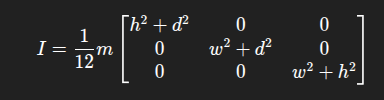
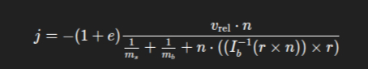

High Level

1. Represent the box with rotational properties
    - [x] rotation represented (quaternion)
    - [x] angular velocity (vec3)
    - [x] inertia tensor in local space (name = I_local) (mat3)
        
    - [x] inverse inertia tensor in local space (name = I_local_inv) for easier calculations

2. Compute collision impulse at contact
    - [x] compute relative velocity at contact point
        relative_velocity = v_sphere - (v_box + omega_box X r)
        where
            r is the vector from the box center to contact point
            omega (W) is the angular velocity
            X is the cross product
    - [x] compute the impulse scalar
        
        
        where
            e is the coeeficient of restitution
            m_s, m_b = sphere and box mass
            n = contact normal pointing from box to sphere
            I_b-1 = inverse inertia tensor of box in world space
    - [x] compute the impulse vector
        J = dot(j, n)
        where
            j is the impulse scalar
            J is the impulse vector
3. Apply linear and angular impulse
    - [x] sphere
        vel_sphere += J/mass_sphere
    - [x] box (linear)
        vel_box += -J/mass_box
    - [x] box (angular)
        vel_angular_box += I_world_inv * cross(r, -J)
        where
            I_world_inv is inverse inertia tensor in world space
4. Update box rotation
    - [x] q_new = normalize(q + (0.5*deltaTime*q*w_quat)))
        where
            w_quat = omega_quat = (0, w_x, w_y, w_z)
5. Additional notes
    - [x] convert local inertia tensor to world space before use
        glm::mat3 R = glm::toMat3(box.rotation); // quaternion → rotation matrix
        glm::mat3 I_world_inv = R * box.I_local_inv * glm::transpose(R);
    - [x] make sure the collision detection point "r" is relative to the center of mass
    - [ ] use a small timestep for rotation integration to avoid instability

6. Fix weird behavior
    - [x] Penetration correction. After collision occurs, separate the objects
    ```
    // After applying impulse, separate the objects
    float penetration_depth = sphere.radius - glm::dot(contact.point - sphere.position, n);
    if (penetration_depth > 0.0f) {
        // Push sphere out along normal
        float total_inv_mass = (1.0f / sphere.mass) + (1.0f / box.mass);
        float sphere_correction = (penetration_depth / total_inv_mass) * (1.0f / sphere.mass);
        float box_correction = (penetration_depth / total_inv_mass) * (1.0f / box.mass);
        
        sphere.position += n * sphere_correction;
        box.position -= n * box_correction;
    }
    ```
    - [x] Guard against multiple collisions per frame. Potentially redundant, might want to just assert this for now.
    ```
    // At the start of resolveElasticCollision:
    if (rel_vel_along_normal > 0.0f) {
        // Objects separating, don't resolve
        return;
    }
    ```
    - [x] Use fixed timestep
    ```
    // In your update loop:
    const float FIXED_DT = 1.0f / 60.0f;
    float accumulator = 0.0f;
    
    void update(float dt) {
        accumulator += dt;
        while (accumulator >= FIXED_DT) {
            physics_step(FIXED_DT);  // Always same dt
            accumulator -= FIXED_DT;
        }
    }
    ```
    - [ ] Add damping to angular velocity. This prevents runaway rotation
    ```
    // After applying impulse:
    box.angular_velocity *= 0.98f;  // Slight damping prevents runaway rotation
    ```

